# video2doc

_[中文](README.md) | English_

Transform video content into structured knowledge documentation and archive to Notion knowledge base.

> 💡 **Design Philosophy**: This project uses Agent Skills to let AI do the work automatically. You just describe the goal.

## Workflow Overview

```mermaid
flowchart LR
    subgraph Input
        V[🎬 Video]
        R[📄 References]
    end

    subgraph Skills["Agent Skills"]
        S1[video-to-markdown]
        S2[whisper-transcription]
        S3[notion-knowledge-capture]
    end

    subgraph MCP["MCP Tools"]
        T1[DeepResearch]
        T2[Notion]
    end

    subgraph Output
        N[📚 Notion Knowledge Base]
    end

    V --> S1
    S1 --> S2
    R --> S3
    S2 --> S3
    S3 --> T1
    T1 --> S3
    S3 --> T2
    T2 --> N
```



## Quick Start

### 1. Clone the Project

```bash
git clone https://github.com/nblog/video2doc.git && cd video2doc
```

### 2. Let AI Do the Work

Open the project in VS Code with GitHub Copilot / Claude Code, and simply tell it what you want:

#### Example 1: Video to Document

```
Transcribe video.mp4 into a document
```

AI will automatically:
- Read `video-to-markdown` Skill
- Extract audio with ffmpeg
- Transcribe with Whisper
- Generate timestamped Markdown

#### Example 2: Video Transcription with Notion Archive

```
Transcribe video.mp4, integrate references, and archive to Notion
```

AI will automatically:
- Read `video-to-markdown` + `notion-knowledge-capture` Skills
- Transcribe video content
- Supplement with background research via DeepResearch
- Create structured Notion page

#### Example 3: Fix CUDA Issues

```
CUDA is not available, fix it
```

AI will automatically:
- Read `uv-cuda-setup` Skill
- Check environment configuration
- Modify pyproject.toml
- Resync dependencies

## Skills Overview

| Skill | Trigger Scenarios |
|-------|------------------|
| `video-to-markdown` | Video to document, video transcription |
| `whisper-transcription` | Speech recognition, audio transcription |
| `ffmpeg-audio-extraction` | Extract audio, media processing |
| `uv-cuda-setup` | CUDA unavailable, GPU configuration |
| `notion-knowledge-capture` | Knowledge archiving, note organization |
| `notion-research-documentation` | Research documentation integration |

## How It Works


## Requirements

| Component | Description |
|-----------|-------------|
| VS Code | + GitHub Copilot or Claude Code |
| Python 3.12+ | Managed by uv |
| FFmpeg | Audio extraction |
| NVIDIA GPU | Optional, accelerate transcription |

## Project Structure

```
video2doc/
├── main.py                    # CLI tool
├── pyproject.toml             # Project configuration
├── .github/skills/            # Agent Skills (Core)
│   ├── video-to-markdown/
│   ├── whisper-transcription/
│   ├── ffmpeg-audio-extraction/
│   ├── uv-cuda-setup/
│   ├── notion-knowledge-capture/
│   └── ...
└── README.md
```
