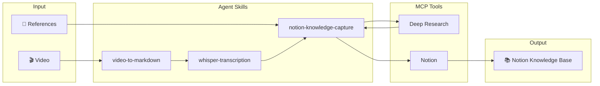
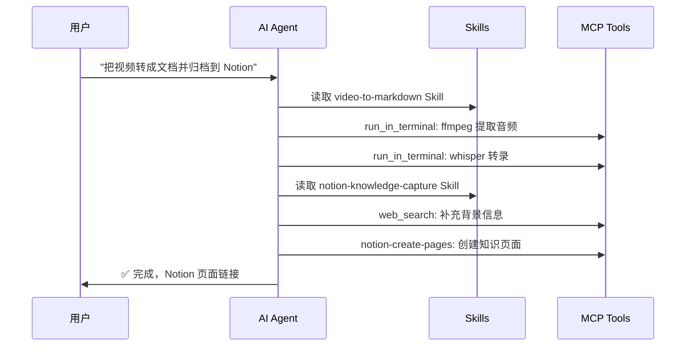

# video2doc

_中文 | [English](README.en.md)_

将视频内容转化为结构化知识文档，并归档至 Notion 知识库。

> 💡 **设计理念**：本项目通过 Agent Skills 让 AI 自动完成工作，你只需描述目标。

## 工作流概览



## Quick Start

### 1. 克隆项目

```bash
git clone https://github.com/nblog/video2doc.git && cd video2doc
```

### 2. 让 AI 开始工作

在 VS Code 中打开项目，使用 GitHub Copilot / Claude Code，直接告诉它你要做什么：

#### 示例 1：视频转文档

```
把 复利工程.mp4 转成文档
```

AI 会自动：
- 读取 `video-to-markdown` Skill
- 使用 ffmpeg 提取音频
- 使用 Whisper 转录
- 生成带时间戳的 Markdown

#### 示例 2：视频转录并归档到 Notion

```
把 复利工程.mp4 转录后，整合参考资料，归档到 Notion
```

AI 会自动：
- 读取 `video-to-markdown` + `notion-knowledge-capture` Skills
- 转录视频内容
- 通过 Tavily 搜索补充背景信息
- 创建结构化 Notion 页面

#### 示例 3：修复 CUDA 问题

```
CUDA 不可用，帮我修复
```

AI 会自动：
- 读取 `uv-cuda-setup` Skill
- 检查环境配置
- 修改 pyproject.toml
- 重新同步依赖

## Skills 一览

| Skill | 触发场景 |
|-------|----------|
| `video-to-markdown` | 视频转文档、视频转录 |
| `whisper-transcription` | 语音识别、转录音频 |
| `ffmpeg-audio-extraction` | 提取音频、媒体处理 |
| `uv-cuda-setup` | CUDA 不可用、GPU 配置 |
| `notion-knowledge-capture` | 知识归档、笔记整理 |
| `notion-research-documentation` | 研究文档整合 |

## 工作原理



## 环境要求

| 组件 | 说明 |
|------|------|
| VS Code | + GitHub Copilot 或 Claude Code |
| Python 3.12+ | uv 自动管理 |
| FFmpeg | 音频提取 |
| NVIDIA GPU | 可选，加速转录 |

## 项目结构

```
video2doc/
├── main.py                    # CLI 工具
├── pyproject.toml             # 项目配置
├── .github/skills/            # Agent Skills（核心）
│   ├── video-to-markdown/
│   ├── whisper-transcription/
│   ├── ffmpeg-audio-extraction/
│   ├── uv-cuda-setup/
│   ├── notion-knowledge-capture/
│   └── ...
└── README.md
```